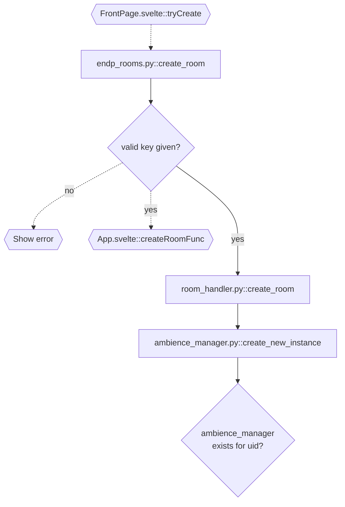

# Ambimancer

## Diagrams

### User flows

```mermaid
flowchart
    fc{{FrontPage.svelte::tryCreate}} -.-> endp[endp_rooms.py::create_room]
    endp --> valid{valid key given?}
    valid -.->|no| err{{Show error}}
    valid --->|yes| handc[room_handler.py::create_room]
    valid -.->|yes| crfnc{{App.svelte::createRoomFunc}}
    handc --> mannew[ambience_manager.py::create_new_instance]
    mannew --> exists{ ambience_manager \nexists for uid? }
```
